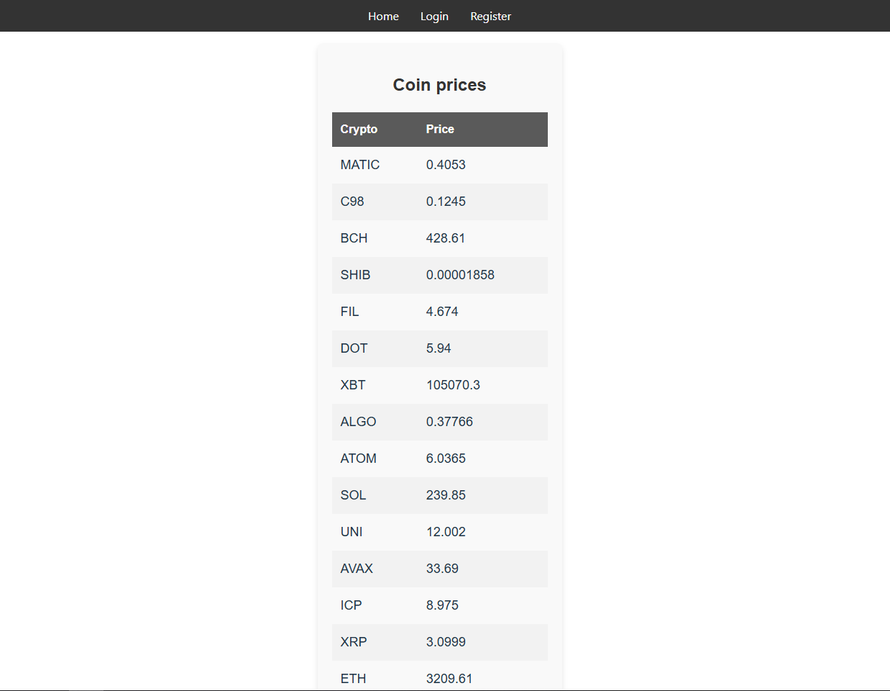
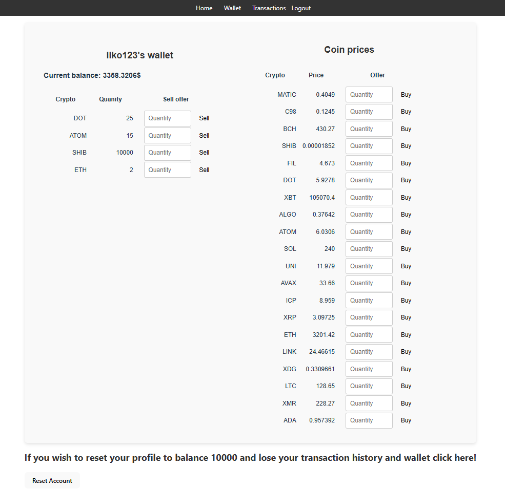
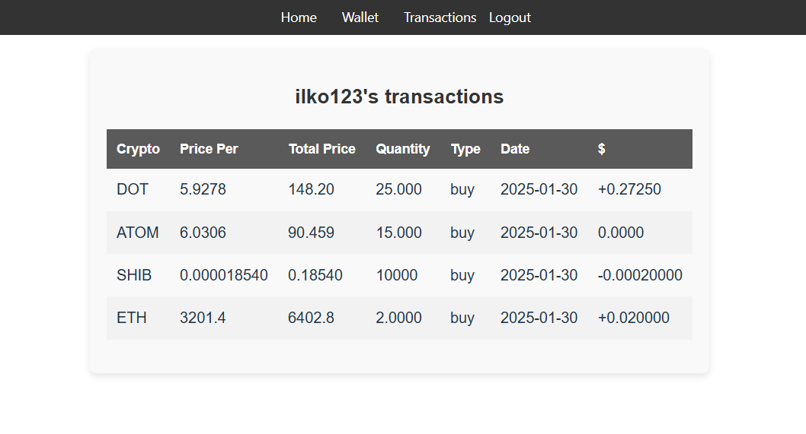
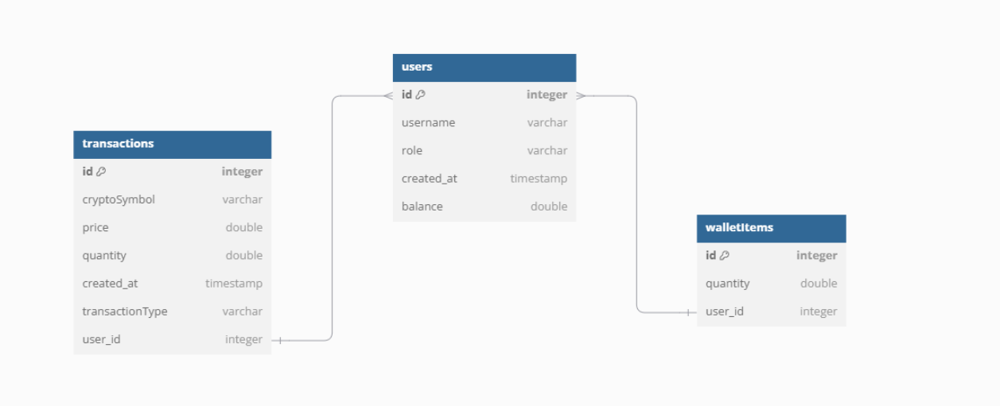

# Crypto-Portal
A website to manage your imaginary Crypto wallet.

## Technologies
Java Spring boot and React.

## To run the project

### Spring boot
Run the java application.

### React
In ..\Crypto-Portal\Frontend\crypto-frontend
`npm run dev`

## Images

### Home page

### Auth

### Wallet page

### Transaction page

<video width="320" height="240" controls>
  <source src="docs/Video/video.mkv.mp4" type="video/mp4">
  Your browser does not support the video tag.
</video>

### Scheme

